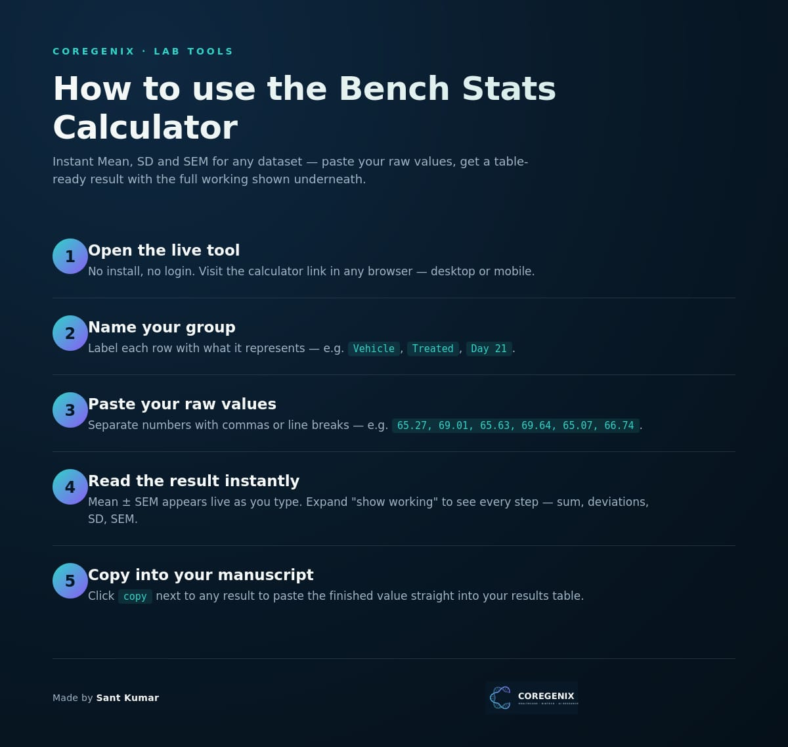

# Bench Stats — Mean · SD · SEM Calculator

A live, no-install calculator for biostatistics. Paste raw values for any number of groups and get **Mean, SD, and SEM** instantly — with the full working shown, and a one-click copy for your results table.

**[Try the live tool →](https://coregenix.github.io/biostats-bench/)**

## What it does

- Add as many groups as you need (e.g. control, treated, multiple timepoints)
- Paste values comma- or line-separated — any sample size, not fixed to 6
- See **n**, mean, and SEM update live as you type
- Expand **"show working"** on any group to see the full step-by-step calculation: sum → mean → deviations → squared deviations → SD → SEM
- Click **copy** to grab the finished `mean ± SEM` value, ready to paste into a manuscript or thesis table

## How to use

1. Open the [live link](https://coregenix.github.io/biostats-bench/) — works in any browser, desktop or mobile
2. Name your first group (e.g. `Vehicle`, `Day 21`)
3. Paste your raw values into the box below it — separated by commas or line breaks
4. Read the result — Mean ± SEM updates instantly as you type
5. Click **+ add group** to add more rows
6. Click **copy** next to any result to grab the finished value for your table

## Method

- **SD** is calculated as the *sample* standard deviation (divides by n − 1)
- **SEM** = SD ÷ √n
- SD and SEM require at least 2 values per group; a single value shows the mean only

## Running it yourself

This is a single self-contained `index.html` file — no build step, no dependencies.

- **Online:** hosted automatically via GitHub Pages at the link above
- **Offline:** download `index.html` and open it directly in any browser
- **Your own copy:** fork this repo, or drag `index.html` into [Netlify Drop](https://app.netlify.com/drop) for an instant separate link

---

**Bench Stats**
Sant Kumar (COREGENIX)
